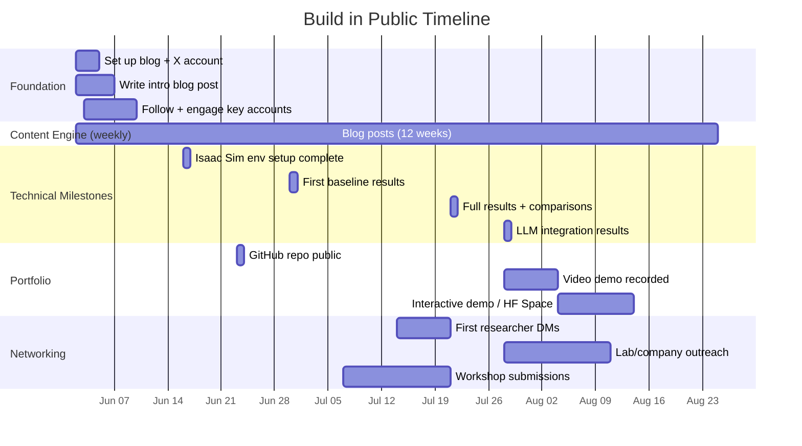

> [!CAUTION]
> **SUPERSEDED DOCUMENT — DO NOT USE FOR CURRENT PROJECT DECISIONS**
>
> This strategy was written during early planning and references outdated project details:
> - **Title**: Now "Causal Inference for Robotic Grasp Failure Diagnosis under Perceptual Degradation" (not "Autonomous Counterfactual Reasoning... Diagnosis and Recovery")
> - **Simulator**: Now MuJoCo (not Isaac Sim)
> - **Method**: Linear SCM + Pearl counterfactuals (not CausalVAE or β-VAE)
> - **Variables**: σ_d, ρ, φ, θ (not lighting, shadow, camera distance)
> - **Scope**: Diagnosis only (no recovery actions)
> - Blog post topics referencing Isaac Sim, CausalVAE, β-VAE, and recovery are all outdated
>
> For current project design, see the SCM Variable Design and Introduction v2 artifacts in the Antigravity brain directory.

# Build in Public: 12-Week Strategy (ARCHIVED)
## Causal Robotics Reasoning → Job at a Company You Admire

**Timeline**: June 2 – August 21, 2026 (~12 weeks)
**Thesis**: *Causal Inference for Robotic Grasp Failure Diagnosis under Perceptual Degradation*

---

## The Core Idea

You're not just writing a thesis — you're building **public proof** that you can think about the hardest problems in embodied AI. The companies you want to attract (NVIDIA, Google DeepMind, Physical Intelligence, Covariant/Amazon, Toyota Research, Boston Dynamics AI Institute, etc.) all need people who combine **causal reasoning + robotics + LLMs**. That intersection is rare. Your job over 12 weeks is to make it obvious that you're one of those people.

---

## 1. Blog (Long-Form, Weekly)

### Where to Host
- **Substack** (built-in audience discovery, email list) or **personal site** (Hugo/Jekyll on GitHub Pages for credibility + SEO). I'd recommend **both**: write on your personal site and cross-post to Substack for distribution.

### Content Calendar (12 posts)

| Week | Date | Post Topic | Why It Attracts Companies |
|------|------|-----------|--------------------------|
| 1 | Jun 2 | "Why I'm Studying Causal Inference for Robots (Not Just for Fairness or Econ)" | Sets the narrative. Shows you understand the landscape. |
| 2 | Jun 9 | "SCMs in 10 Minutes: The Mental Model Every Roboticist Should Have" | Demonstrates teaching ability — a signal of deep understanding. |
| 3 | Jun 16 | "My Causal Graph for Grasp Failure — and Why I Chose These 4 Factors" | Shows design thinking. Opens your work to feedback. |
| 4 | Jun 23 | "Isaac Sim for Causal Robotics: Setting Up Controllable Distribution Shifts" | Practical engineering content. NVIDIA will literally notice this. |
| 5 | Jun 30 | "CausalVAE vs β-VAE vs Vanilla VAE: What Disentanglement Actually Buys You in Robotics" | Technical depth. Shows you understand the baselines deeply. |
| 6 | Jul 7 | "Autonomous Counterfactual Queries: How My Robot Decides *What* to Ask" | This is your key contribution (Sec 4.2). Make it a standalone piece. |
| 7 | Jul 14 | "First Results: Does Causal Structure Actually Help Diagnosis?" | Raw results + honest interpretation. Vulnerability builds trust. |
| 8 | Jul 21 | "Grounding LLMs in Causal Outputs: What Happens When GPT Meets a Structural Causal Model" | LLM + causality crossover content — guaranteed engagement. |
| 9 | Jul 28 | "What My Robot Gets Wrong: Failure Cases and What They Teach Us" | Mature researcher energy. Shows you don't hide from bad results. |
| 10 | Aug 4 | "Causal Representation Learning: Where the Field is Heading (Literature Map)" | Positions you as someone who sees the big picture. |
| 11 | Aug 11 | "From Simulation to Reality: What Would It Take to Deploy This?" | Forward-looking. Shows you think about real-world impact. |
| 12 | Aug 18 | "What I Learned Building a Causal Reasoning System for Robots in 12 Weeks" | Retrospective. Perfect for sharing widely. |

### Blog Post Format
Each post should be:
- **~1500 words** (readable in 7 min)
- **Include at least one diagram/figure** (your TikZ causal graphs are perfect for this)
- **End with an open question** to invite discussion
- **Link to your code** (even if WIP)

---

## 2. X/Twitter Strategy

### Profile Setup
- **Handle**: Something like `@bonolo_causal` or your real name
- **Bio**: "MSc researcher · Causal inference × Robotic reasoning × LLMs · Building an autonomous failure diagnosis system for robots · [Blog link]"
- **Pinned tweet**: Your Week 1 blog post as a thread

### Who to Follow (and engage with — not just follow)

#### Causal Inference / Causal ML
- Judea Pearl (`@yaborpearl`)
- Elias Bareinboim (`@eaboreinboim`) — causal AI lab at Columbia
- Bernhard Schölkopf (`@baborernhard`) — causality + ML at MPI Tübingen
- Ilya Shpitser, Jonas Peters — causal inference researchers
- Brady Neal (`@bradyneal_`) — excellent causal ML educator

#### Embodied AI / Robotics
- Jim Fan (`@DrJimFan`) — NVIDIA, embodied AI lead
- Ted Xiao, Andy Zeng, Pete Florence — Google DeepMind robotics
- Chelsea Finn (`@chelseabfinn`) — Stanford, robot learning
- Lerrel Pinto (`@lerrelpinto`) — NYU, robot manipulation
- Sergey Levine (`@svlevine`) — UC Berkeley
- Physical Intelligence team (`@physical_int`)
- Karl Pertsch, Lucy Shi — Stanford, robot foundation models

#### Scientific AI / Causal Representation Learning
- Francesco Locatello — causal rep learning
- Julius von Kügelgen — causal rep learning (MPI/Cambridge)
- Yoshua Bengio (`@yoshuabengio`) — causal reasoning advocate
- David Lopez-Paz — Meta, causality
- Dhanya Sridhar — causal ML

#### Your Supervisor's Network
- Dezong Zhao, Daniel Flynn, and their collaborators (from your references)

### Posting Cadence
- **3–5 tweets per week minimum**
- **1 thread per week** (aligned with blog post)
- **2–3 engagement replies per day** (reply to researchers you admire with substance, not "Great work!")

### Tweet Types That Work

| Type | Example | Frequency |
|------|---------|-----------|
| **Progress update** | "Week 4: Got Isaac Sim rendering controllable shadow maps for 500 grasp scenarios. Here's what the distribution shift looks like ↓ [image]" | 2×/week |
| **Technical insight** | "Interesting finding: β-VAE gives you disentanglement but NOT causal structure. My robot diagnosed the wrong failure factor 40% of the time without the causal mask layer. Disentanglement ≠ causality." | 1×/week |
| **Literature thread** | "I read 12 papers on causal representation learning this week. Here's what I think the field is missing for robotics 🧵" | 1×/2 weeks |
| **Question** | "For the causal robotics people: how do you handle hidden confounders when your causal graph is learned from simulation? Genuinely stuck on this." | 1×/week |
| **Behind-the-scenes** | "Debugging why my counterfactual queries keep predicting the wrong recovery action. The anomaly threshold τ is doing way more work than I expected." | 1×/week |

### Engagement Rules
1. **Reply to papers on the day they drop** — especially from the people above. Add a substantive observation, not just praise.
2. **Quote-tweet with insight** — "This connects to [X] because..." shows you can synthesize.
3. **Tag people sparingly but strategically** — if your Isaac Sim post is relevant to NVIDIA's work, tag Jim Fan. But only when it's genuinely relevant.
4. **Share your failures** — "My causal model completely broke under 60% occlusion. Here's why..." gets more engagement than success stories.

---

## 3. Code & Portfolio

### GitHub
- **Make your thesis code public** (or at least the non-proprietary parts)
- Clean README with:
  - System architecture diagram
  - GIF/video of the robot grasping in Isaac Sim
  - Clear reproduction instructions
  - Results tables
- **Star/contribute to repos** in the causal ML space (CausalVAE, DoWhy, etc.)

### Demos That Get Hired
Build **at least one of these** as a standalone demo:

1. **Interactive Causal Graph Explorer** (web app)
   - Let users intervene on nodes (shadow, occlusion, viewpoint) and see how the predicted grasp success changes
   - Use your actual trained model behind it
   - This is a portfolio piece that will blow away any recruiter

2. **Video Demo** (~3 min, YouTube)
   - Show Isaac Sim environment
   - Robot fails a grasp → system runs counterfactual diagnosis → identifies shadow as cause → recovery action succeeds
   - Narrate the causal reasoning happening under the hood
   - This is your "proof of work" — more powerful than any resume bullet point

3. **Colab Notebook / HuggingFace Space**
   - Let anyone run a simplified version of your counterfactual diagnosis
   - Input: scene parameters → Output: diagnosed failure factor + recovery recommendation
   - Lower barrier than cloning a repo

---

## 4. Networking & Visibility

### Conference / Workshop Engagement
- **RSS 2026** (Robotics: Science and Systems) — July 2026, check for workshop submission deadlines
- **ICML 2026 Workshops** — causality workshops often accept short papers
- **CoRL 2026** abstract deadline is usually ~August — you might make it
- Even if you can't submit, **attend virtually and live-tweet** interesting talks

### Direct Outreach (After You Have Content)
By week 6–8, when you have blog posts + results:
1. **DM researchers** whose work you built on (especially Ye et al., 2026 — your primary reference). Say something specific: "I extended your Causal DiffuseVAE to autonomous failure diagnosis in robotics — here's what I found [link]"
2. **Email labs** you want to join with a 3-line note + link to your blog/demo
3. **Apply to research internships** at NVIDIA (Robotics/Isaac Sim team), Google DeepMind (Robotics), Physical Intelligence, Toyota Research Institute — your thesis is directly aligned

### Communities
- **Causal Inference Discord/Slack** — share your posts
- **Robotics subreddits** (r/robotics, r/MachineLearning for paper discussions)
- **EleutherAI / LAION Discord** — for the scientific AI crowd

---

## 5. Week-by-Week Timeline



---

## 6. Companies to Target (and Why Your Thesis Matters to Them)

| Company | Why They Care About Your Work | Who to Reach |
|---------|-------------------------------|--------------|
| **NVIDIA** (Isaac Sim / Robotics) | You're literally using their simulator for causal robotics research | Jim Fan, Yuke Zhu, Dieter Fox |
| **Google DeepMind** (Robotics) | They're building foundation models for robots — causal reasoning is a gap | Ted Xiao, Andy Zeng, RT-X team |
| **Physical Intelligence (π)** | Building general-purpose robot foundation models. Need failure diagnosis. | Karol Hausman, Chelsea Finn (advisor network) |
| **Toyota Research Institute** | Manipulation in unstructured environments is their core problem | Russ Tedrake's team |
| **Boston Dynamics AI Institute** | Next-gen robot intelligence. Causal reasoning is unexplored there. | Marc Raibert's new lab |
| **Covariant** (now Amazon Robotics) | Warehouse manipulation under distribution shift — your exact problem | Pieter Abbeel's network |
| **Dyson** (Robotics R&D, UK-based) | Household robotics with visual distribution shift | UK presence is an advantage |
| **Amazon Robotics / Lab126** | Scale manipulation with failure recovery | Applied research roles |

---

## 7. The Meta-Strategy: What Actually Gets You Hired

> [!IMPORTANT]
> Companies don't hire based on thesis grades. They hire based on **signal**:
> 1. **Can this person do real research?** → Your blog posts and results prove this.
> 2. **Can they ship?** → Your demo/code/video proves this.
> 3. **Are they in our orbit?** → Your X presence and engagement proves this.
> 4. **Do others vouch for them?** → Researcher interactions and retweets prove this.

### The Flywheel
```
Blog post → Tweet thread → Engagement from researchers
    ↓                              ↓
  GitHub repo ← ← ← ← ← ← New followers
    ↓                              ↓
  Demo/video → Shared by someone with reach
    ↓                              ↓
  DM from recruiter/researcher ← ← ←
```

### What NOT to Do
- ❌ Don't wait until the thesis is "done" to share. Share *in progress*.
- ❌ Don't only post polished results. Raw WIP gets more engagement.
- ❌ Don't write generic "AI is the future" content. Be specific to YOUR niche.
- ❌ Don't cold-DM people without content to show. Build first, then reach out.
- ❌ Don't try to be everywhere — blog + X + GitHub is enough. Skip LinkedIn spam.

### What You SHOULD Do Differently From Most MSc Students
- ✅ **Frame everything as a story**: "Robot fails → Why? → Causal reasoning → Recovery → Success"
- ✅ **Name your system** — give it a memorable name (e.g., "CausalGrasp", "CounterRobot", etc.)
- ✅ **Record everything** — screen recordings of Isaac Sim, training curves, failure cases. Content is cheap to capture, expensive to recreate.
- ✅ **Write like a practitioner, not an academic** — your blog should be readable by a senior engineer, not just professors.
- ✅ **Connect to industry problems** — "This is how a warehouse robot could use causal reasoning to recover from lighting changes" lands differently than "We improved diagnosis accuracy by 15%."

---

## 8. Quick Wins This Week (June 2–8)

- [ ] Set up X account with proper bio, profile pic, banner
- [ ] Follow the 20+ accounts listed above
- [ ] Set up blog (Substack or personal site)
- [ ] Write and publish Post #1: "Why I'm Studying Causal Inference for Robots"
- [ ] Tweet a thread version of Post #1
- [ ] Make your thesis repo public on GitHub (even if mostly empty — add a good README)
- [ ] Reply thoughtfully to 3 tweets from researchers in the list above

---

> [!TIP]
> **The single most important thing**: consistency. One blog post per week + daily engagement for 12 weeks will put you ahead of 99% of MSc students in visibility. You don't need to go viral. You need the right 50 people to know your name.
